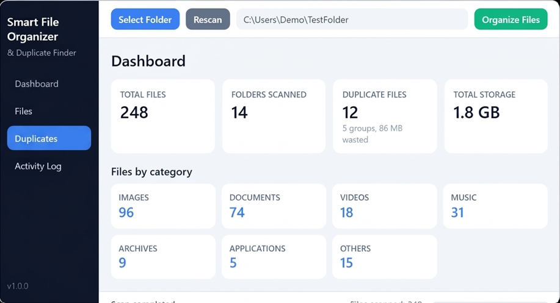
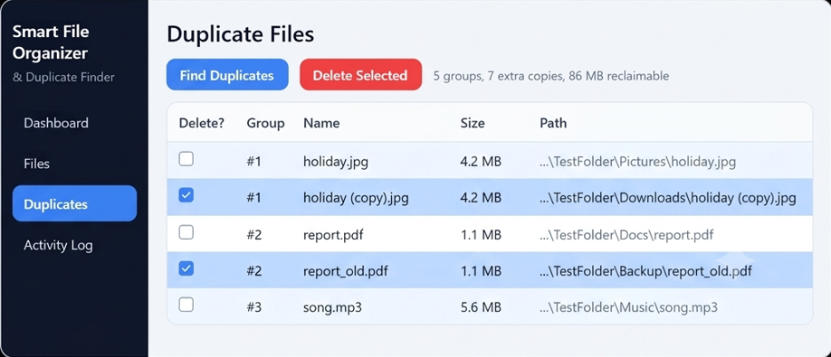
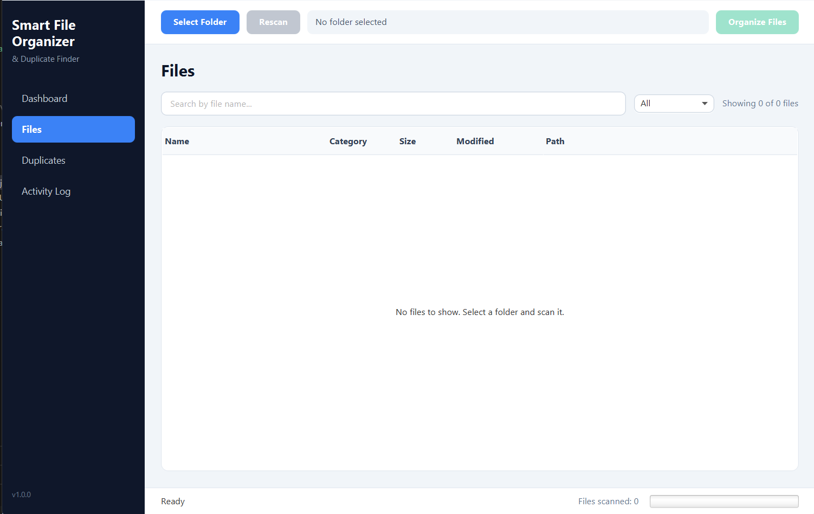
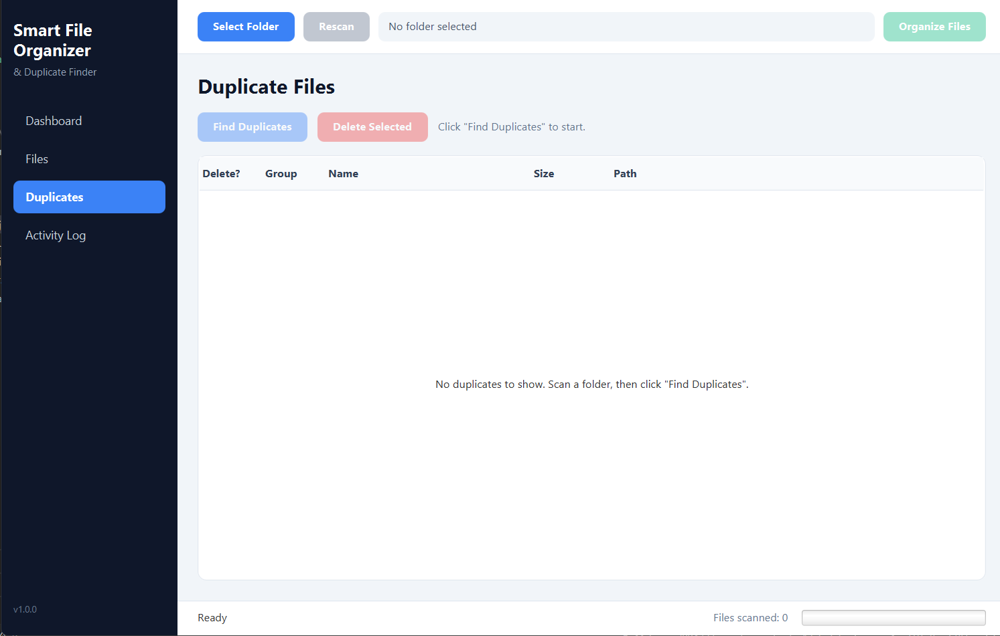
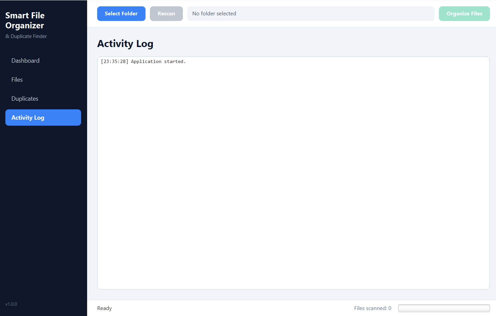

# Smart File Organizer & Duplicate Finder

A modern JavaFX desktop app that scans a folder, categorizes files, finds duplicate files using **SHA-256 content hashing**, and organizes files into category folders safely.

## Features
- Folder chooser with validation and recursive scanning (background thread, UI never freezes)
- File categories: Images, Documents, Videos, Music, Archives, Applications, Others
- Modern table (Name, Category, Size, Modified, Path) with sorting
- Search by file name + category filter
- Dashboard: total files, folders scanned, duplicate files, total storage, per-category counts
- Duplicate finder: group by size first, then SHA-256 only for same-size candidates
- Safe delete: manual selection + confirmation, never automatic
- Organize Files: moves files into category folders, with confirmation and conflict-safe renaming (`file (1).txt`)
- Progress bar, status text, activity log
- Graceful handling of empty/inaccessible folders and failed file operations

## Tech Stack
Java 21, JavaFX 21, Maven, Java NIO, JUnit 5, JavaFX CSS

## Requirements
- JDK 21
- Maven 3.9+
- Windows (also works on macOS/Linux)

## Installation
```bash
git clone https://github.com/<your-username>/smart-file-organizer.git
cd smart-file-organizer
```

## How to Run
```bash
mvn clean javafx:run
```

## How to Build
```bash
mvn clean package
java -jar target/smart-file-organizer-1.0.0.jar
```

## Run Tests
```bash
mvn test
```

## Project Structure
```text
pom.xml
src/main/java/com/smartorganizer/
    Main.java, Launcher.java
    controller/MainController.java
    model/      Category, FileInfo, ScanResult, DuplicateGroup, DuplicateRow
    service/    FileScanner, DuplicateFinder, FileOrganizer, FileDeleter
    util/       FileUtil, FormatUtil, HashUtil
src/main/resources/css/style.css
src/test/java/...
screenshots/
```

## Screenshots

### Demo Images

<p align="center">
  
  
  
</p>

<p align="center">
  
  
</p>

## Future Improvements
- Move deleted files to Recycle Bin
- Undo for organize
- Export duplicate report (CSV)
- Custom category rules
- Dark theme
